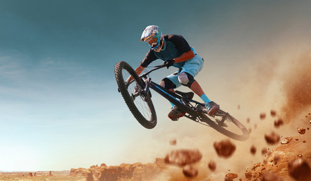

# 🚀 Adventure Bicycle Sales Dashboard 
Adventure Bicycle Company is dedicated to providing high-quality bicycles and accessories for cycling enthusiasts.
&nbsp;
## Overview

This Power BI dashboard provides comprehensive insights into the sales performance of a bicycle business. It visualizes data related to revenue, profit, orders, and return rates, enabling data-driven decisions. The dashboard includes interactive visuals and filters for enhanced user experience.

## Tool used :
&nbsp;
## 🔎 1. Key Performance Metrics
### 💰 Revenue: $24.9M
The company has generated $24.9 million in total revenue over the analyzed period (2020–2022).
The revenue trend shows consistent growth, with a noticeable upward spike around mid-2021, indicating a period of strong sales performance.
### 💵 Profit: $10.5M
With a profit of $10.5 million, the company maintains a healthy profit margin, suggesting efficient cost management and product pricing strategies.
### 📦 Total Orders: 25K
The company processed 25,000 orders, indicating a strong demand for its products, especially in the Accessories and Bikes categories.
### 🔄 Return Rate: 2.2%
The return rate is relatively low, reflecting customer satisfaction and quality products.
However, some individual products have higher return rates, which may require investigation into potential quality or sizing issues.
## 📈 2. Revenue Trend Analysis
The revenue trend chart shows a steady increase over the two-year period.
### Key observations:
There is a noticeable spike around mid-2021, potentially due to a promotional campaign, new product release, or seasonal sales.
The dotted trend line indicates consistent growth, suggesting positive business momentum.
## 🛒 3. Orders by Categories
### Accessories:
The highest-selling category with 17K orders, indicating strong demand for add-ons and bike-related gear.
### Bikes:
Second-largest category with 13.9K orders, contributing significantly to revenue.
### Clothing:
Although fewer orders (7K), this category may have potential for growth through marketing and bundling strategies.
## 🔥 4. Product Performance Insights
Top Performers (Revenue):
### 🚲 Mountain-200 Black, 46:
606 orders, generating $12.41M in revenue with a 2.97% return rate.
This product drives the highest revenue, indicating its popularity and profitability.
### 🚲 Mountain-200 Black, 42:
602 orders, contributing $12.33M with a slightly higher 3.49% return rate.
Highest Return Rate:
### 🔴 Road-150 Red, 48:
Although it generated $6.4M in revenue, it has the highest return rate of 4.47%, which might indicate potential quality or sizing issues.
Lowest Return Rate:
### 🟢 Mountain-200 Silver, 42:
Return rate of 2.74%, indicating customer satisfaction and product reliability.
## 🛍️ 5. Most Ordered & Most Returned Product Types
### Most Ordered:
Tires and Tubes → High order volume suggests these are frequently replaced or upgraded.
### Most Returned:
Shorts → Higher return rate may indicate issues with fit, comfort, or quality, highlighting an area for improvement.
## ✅ Key Takeaways & Recommendations
### Revenue Growth Opportunities:

Leverage the mid-2021 growth trend by analyzing what triggered the spike (promotion, season, etc.) and replicating it in future campaigns.
Introduce loyalty programs or bundle deals to boost Clothing category sales.
### Product Quality and Returns:

Investigate products with high return rates, such as the Road-150 Red, 48, for potential quality issues.
Gather customer feedback to identify pain points and improve product satisfaction.
### Category Expansion:

The Accessories category leads in sales volume, suggesting potential for expanding this line with new products or variants.
Promote Bikes and Clothing through bundled offers or limited-time discounts to increase sales.

## Future Enhancements

Add drill-through features for deeper analysis.

Introduce additional KPIs such as Customer Lifetime Value (CLV).

Improve visual design with enhanced themes.

## Dashboard :
&nbsp;
